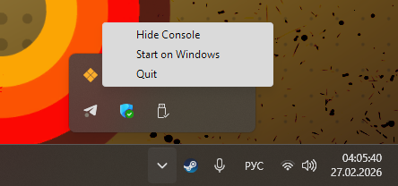
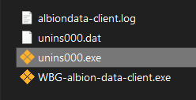

# WBG Albion Online Data Client

Клиент мониторинга сетевого трафика, сделанный для [Albion Online Data Project](https://www.albion-online-data.com/).

**Это форк [ao-data/albiondata-client](https://github.com/ao-data/albiondata-client). Для просмотра и использования официального проекта и его кода, пожалуйста, посетите оригинальный репозиторий.**

**[Детальное описание работы проекта](https://github.com/Henry-Tsukino/wbg-albiondata-client?tab=readme-ov-file#описание-проекта) находится сразу под разделом работы с клиентом(установка/настройка/удаление)**

## Работа с клиентом

### Инсталляция клиента

Скачайте последний релиз клиента из: https://github.com/Henry-Tsukino/wbg-albiondata-client/releases

#### Windows

1. Загрузите со [страницы с релизами](https://github.com/Henry-Tsukino/wbg-albiondata-client/releases) последний дистрибутив инсталятора клиента для Windows: **installer-WBG-tool.exe**
2. Запустите скачанный файл установщика
   1. Выберите язык инсталятора
   2. Согласитесь с принятием лицензии
   3. Выберите **путь** установки программы
   4. Выберите хотите ли **создать ярлык на рабочем столе**
   5. Нажмите кнопку **Установить**
   6. Дождитесь конца установки, снимите галочку с "Запустить приложение" и нажмите кнопку окончания инсталяции
> [!Important]
> **Если вам вылезло предупреждение о безопасности:** не переживайте, у нас просто не нашлось лишних денег чтоб купить лицензию на подпись гарантии о безопасности.
3. Сделайте запуск клиента от имени администратора
   * Кликните ПКМ на ярлык клиента и после выберите "Запуск от имени администратора" в открывшемся меню
4. Проведите дальнейшие настройки клиента через трей(информация как это сделать находится ниже)

#### macOS и Linux

К сожалению, пока что дестрибутивов на эти системы нет, но они планируются в будущем.

### Настройка клиента

Настройки, в частности закрытие консоли клиента, можно найти в системном трее Windows в правом нижнем углу экрана:

* **Hide Console** — Спрятать консоль
* **Start on Windows** — Запуск приложения при старте Windows
> [!NOTE]
> **Рекомендуется включить**, чтоб клиент не приходилось включать при каждом запуске игры
> [!CAUTION]
> В случае, **если ваше устройсво крайне слабое** и работа в фоне, даже такого маленького, приложения вам критична для производительности, **стоит оставить данную настройку выключенной**
* **Quit** — Выключить программу

### Поиск и исправление неисправностей

**В случае, если клиент после запуска:**

* Не появился в системном трее
* Не запускается
* Выдает ошибки
* Ведет себя как-то странно

**Сделайте следующие действия:**

1. Зайдите в папку в которую вы установили клиент
   * Кликните ПКМ на ярлык клиента и после выберите "Открыть расположение файла" в открывшемся меню
2. Найдите в файлах клиента файл **albiondata-client.log**
3. Скиньте данный файл одному из разработчиков, указанных ниже, связавшись с ним через Дискорд
   * [pinok.entracte](https://discordapp.com/users/747787435198513153/ "Discord Pinok")
   * [henry.tsukino](https://discordapp.com/users/603673234138988591/ "Discord Henry Tsukino")

### Удаление клиента

1. Зайдите в папку в которую вы установили клиент

   * Кликните ПКМ на ярлык клиента и после выберите "Открыть расположение файла" в открывшемся меню
2. В открывшемся проводнике нажмите на файл **unins000.exe**

   
3. В открывшемся окне нажмите на кнопку подтверждения удаления
4. Дождитесь удаления клиента и после нажмите **ОК**

## Описание проекта

### Суть работы

Albion Data Client мониторит локальный сетевой трафик вашего устройства, идентифицирует UDP пакеты, содержащие данные игры Albion Online и после отправляет информацию на центральый сервер брокера сообщений NATS для дальнейшего распределения по другим сервисам. Таким образом получается сбор данных, осуществляемый силами сообщества, для аналитики рынка, слежения за событиями и мониторинга игровой статистики.

### Функции

- Мониторинг сетевого трафика в реальном времени с помощью libpcap
- Фильтрование UDP пакетов и их дальнейший анализ для поиска протоколов Albion Online
- Интеграция с системой брокера сообщений NATS
- ~~Поддержка кросс-платформы (Windows, macOS, Linux)~~ (в процессе реализации, пока сделано только у оригинала)
- Интеграция в системный трей Windows ~~and macOS~~
- Минимальное потребление ресурсов системы:
  - Примерно 20мб ОЗУ и 20мб памяти накопителя

### Карается ли баном?

Заявление от **SBI Games**(разработчика) касательно мониторинга сетевых пакетов:

> Our position is quite simple. As long as you just look and analyze we are ok with it. The moment you modify or manipulate something or somehow interfere with our services we will react (e.g. perma-ban, take legal action, whatever).
>
> — MadDave, Technical Lead for Albion Online

Перевод:

> Наша позиция довольно проста. Пока вы просто наблюдаете и анализируете, нас это устраивает. Как только вы что-то измените или манипулируете, или каким-либо образом вмешаетесь в работу наших сервисов, мы отреагируем (например, перманентная блокировка, юридические действия и т. д.).
>
> — MadDave, Технический Руководитель Albion Online

Полный оригинал: https://forum.albiononline.com/index.php/Thread/51604-Is-it-allowed-to-scan-your-internet-trafic-and-pick-up-logs/?postID=512670#post512670

Пользователи должны следовать [Договору об условиях предоставления услуг Albion Online](https://albiononline.com/terms_and_conditions), а также [Правилам игры AlbionOnline](https://albiononline.com/game-rules), при использовании данной программы.

## Сообщество и поддержка

Данный клиент был в первую очередь создан для нужд гильдии World Bank Group.
По интерисующим вас вопросам можете связаться через следующие контакты:

* Дискорд ГИ: [https://discord.gg/kgXREFJzsS](https://discord.gg/kgXREFJzsS "Discord World Bank Group guild")
* Дискорд разработчиков форка:
  * [henry.tsukino](https://discordapp.com/users/603673234138988591/ "Discord Henry Tsukino")
  * [pinok.entracte](https://discordapp.com/users/747787435198513153/ "Discord Pinok")

## Лицензия

Данный форк использует такую же лицензию "[MIT License](https://github.com/Henry-Tsukino/wbg-albiondata-client/blob/main/LICENSE "MIT License info")", как и оригинальный проект.
