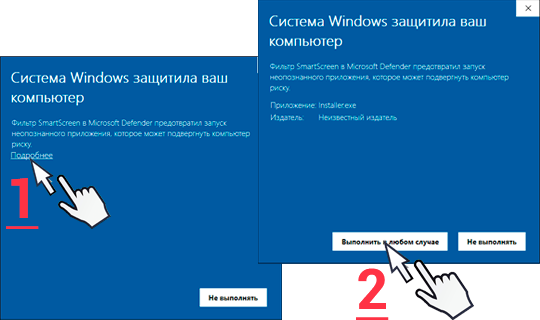
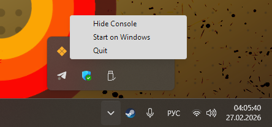
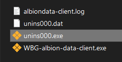

# Установка клиента для Windows

1. Загрузите со [страницы с релизами](https://github.com/Henry-Tsukino/wbg-albiondata-client/releases) последний дистрибутив инсталятора клиента для Windows: **installer-WBG-tool.exe**
2. Запустите скачанный файл установщика
   1. Выберите хотите ли устанавливать для всех пользователей устройства(верхний выбор) или только для себя(нижний выбор)
   2. Выберите язык инсталятора
   3. Согласитесь с принятием лицензии
   4. Выберите **путь** установки программы
   5. Выберите хотите ли **создать ярлык на рабочем столе**
   6. Нажмите кнопку **Установить**
   7. Дождитесь конца установки, снимите галочку с "Запустить приложение" и нажмите кнопку окончания инсталяции

> [!Important]
> **Если вам вылезло предупреждение о безопасности:** не переживайте, у нас просто не нашлось лишних 200$/год чтоб купить лицензию на подпись гарантии о безопасности.
>
> 

3. Сделайте запуск клиента от имени администратора
   * Кликните ПКМ на ярлык клиента и после выберите "Запуск от имени администратора" в открывшемся меню
4. Проведите дальнейшие настройки клиента через [трей](#tray)(информация как это сделать находится ниже)

# Настройка клиента

Настройки, в частности закрытие консоли клиента, можно найти в системном трее Windows в правом нижнем углу экрана:

* **Hide Console** — Спрятать консоль
* **Start on Windows** — Запуск приложения при старте Windows(автозапуск)
* **Quit** — Выключить программу

> [!NOTE]
> **Рекомендуется включить автозапуск**, чтоб клиент не приходилось включать при каждом запуске игры

> [!CAUTION]
> В случае, **если ваше устройсво крайне слабое** и работа в фоне, даже такой маленькой программы, вам критична для производительности, **стоит оставить автозапуск выключенным**

# Удаление клиента

1. Зайдите в папку в которую вы установили клиент

   * Кликните ПКМ на ярлык клиента и после выберите "Открыть расположение файла" в открывшемся меню
2. В открывшемся проводнике нажмите на файл **unins000.exe**

   
3. В открывшемся окне нажмите на кнопку подтверждения удаления
4. Дождитесь удаления клиента и после нажмите **ОК**

[Возврат к изначальному файлу](https://github.com/Henry-Tsukino/wbg-albiondata-client?tab=readme-ov-file#описание-проекта)
